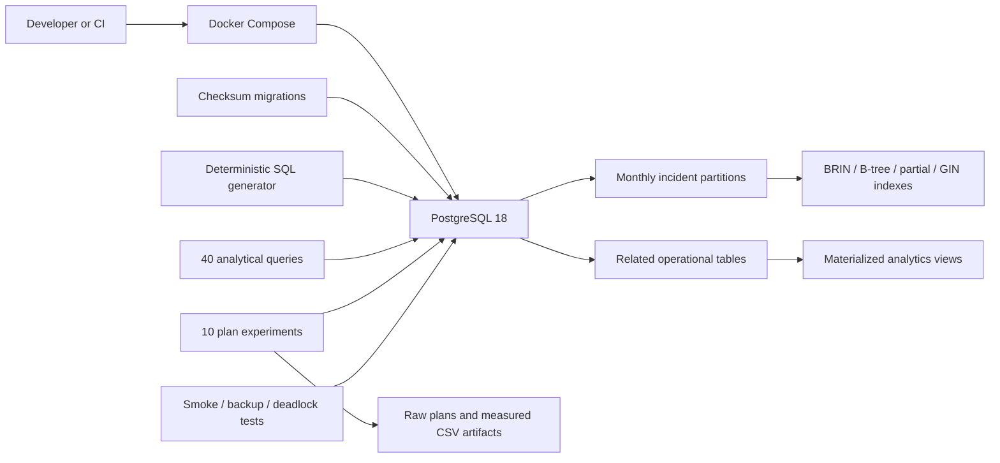

# PostgreSQL Service Desk Analytics

[](https://github.com/German4341374/postgresql-service-desk-analytics/actions/workflows/ci.yml)

An advanced, SQL-first Service Desk analytics laboratory for PostgreSQL. The project builds a deterministic synthetic workload, demonstrates operational database techniques, and measures ten query optimizations using raw `EXPLAIN (ANALYZE, BUFFERS, WAL, SETTINGS)` output.

No cloud account, paid service, or production data is required. The full data profile contains exactly 100,000 users, 200,000 devices, and 1,000,000 incidents, plus comments, assignments, SLA events, and software installations.

## Highlights

- Monthly range partitioning for incidents across 2023–2025, with a default safety partition.
- Purpose-specific B-tree, partial, BRIN, and GIN full-text indexes.
- Forty analytical SQL scenarios covering window functions, recursive CTEs, percentiles, cohort analysis, rankings, materialized views, and data-quality checks.
- Ten reproducible before/after query-plan experiments with actual artifacts, not estimated timings.
- Transactional checksum-verified migrations protected by a PostgreSQL advisory lock.
- Deterministic, parameterized synthetic data generation from SQL only.
- Audit trigger, guarded upserts, retention procedure, row-level security, isolation examples, and a deadlock reproduction with a deterministic-lock-order fix.
- Backup/restore verification, smoke tests, GitHub Actions, and a manual full-scale benchmark.

## Architecture



The incident table is the high-volume center of the model. Its composite identity `(id, created_at)` allows related records to retain referential integrity while PostgreSQL uses `created_at` as the partition key. See [architecture.md](docs/architecture.md) for the detailed data flow and trade-offs.

## Data profile

`SEED_SCALE=1` produces the required full profile:

| Relation | Deterministic rows |
| --- | ---: |
| `service_desk_users` | 100,000 |
| `devices` | 200,000 |
| `technicians` | 2,000 |
| `incidents` | 1,000,000 |
| `incident_comments` | 1,250,000 |
| `incident_assignments` | 1,111,111 |
| `sla_events` | 2,000,000 |
| `software_installations` | 600,000 |

Smaller values of `SEED_SCALE` preserve relationships and distributions for faster development. The default is `0.01`; CI uses `0.002`. The generator records expected counts in `dataset_manifest`, and the smoke suite verifies them.

## Prerequisites

- Docker Engine 27 or newer with Docker Compose v2.
- GNU Make and Bash.
- Linux, or Windows 11 with WSL2 and Docker Desktop WSL integration.
- At least 12 GB of free disk space for a full run; actual usage varies with Docker and PostgreSQL versions.

Run all repository commands from a Bash shell. PowerShell is suitable for launching WSL, but the scripts intentionally use portable Bash tooling.

## Quick start

```bash
cp .env.example .env
make setup
```

`make setup` starts PostgreSQL, waits for readiness, migrates, generates the default scaled data set, creates analytical indexes, refreshes materialized views, and runs schema smoke tests.

Connect interactively:

```bash
docker compose exec database psql -U service_desk -d service_desk_analytics
```

Run one analytical query:

```bash
docker compose exec -T database \
  psql -U service_desk -d service_desk_analytics \
  -v ON_ERROR_STOP=1 \
  -f /workspace/queries/analytics/04_resolution_percentiles.sql
```

Stop or remove the environment:

```bash
make down     # preserve the named volume
make clean    # remove the volume and generated local artifacts
```

## Full-scale generation and benchmarking

The full profile is intentionally opt-in because it consumes significant local CPU, memory, disk, and time:

```bash
make clean
SEED_SCALE=1 make setup
make benchmark
```

The benchmark does the following for each of ten cases:

1. removes only the optional analytical indexes;
2. analyzes the base relations;
3. executes a warm-up run;
4. captures the baseline execution plan;
5. creates the proposed indexes and analyzes again;
6. executes a second warm-up run;
7. captures the optimized plan;
8. extracts PostgreSQL's reported execution time into `summary.csv`.

Generated local results live under `optimization/results/generated/` and are ignored by Git. The manual `Full-scale benchmark` GitHub workflow requires the exact confirmation phrase `RUN_FULL_BENCHMARK` and uploads its raw plans as a run artifact. The [measured performance report](docs/performance-report.md) records a successful one-million-incident run, including a candid GIN regression, and links every committed raw plan. No benchmark number is documented without a successful measured run.

## Query catalog

The repository includes exactly forty numbered analytical scenarios in `queries/analytics/`. They cover operational backlog, SLA behavior, technician workloads, requester and device recurrence, software inventory, trends, percentiles, partitions, and data quality. [The query catalog](docs/query-catalog.md) maps every file to its technique and business question.

Ten representative access paths are evaluated in `optimization/queries/`. The raw baseline and optimized plan output includes buffers, WAL, PostgreSQL settings, planning time, and execution time. Index definitions are isolated in `optimization/apply.sql` so they can be compared without altering core schema migrations.

## Operational demonstrations

### Safe migrations

```bash
make migrate
make migrate
```

The second run makes no schema changes. Applied file checksums are stored in `schema_migrations`; changing an applied migration fails closed. A session advisory lock serializes migration runners.

### Audit and safe upsert

```bash
docker compose exec -T database psql -U service_desk -d service_desk_analytics \
  -f /workspace/queries/operations/safe_upsert_demo.sql
```

The incident audit trigger records old and new row images for updates and deletes. The upsert function only accepts newer device observations and cannot overwrite newer state with delayed input.

### Row-level security

```bash
docker compose exec -T database psql -U service_desk -d service_desk_analytics \
  -f /workspace/queries/operations/rls_demo.sql
```

The demo uses a transaction-local department setting and rolls back. Its purpose is to show database enforcement, not a complete authorization system.

### Isolation and deadlocks

The two isolation scripts are intended for separate `psql` sessions. `make deadlock` deliberately creates opposite lock order, verifies PostgreSQL selected a deadlock victim, and repeats the work with rows locked in stable ID order.

### Retention

```bash
docker compose exec -T database psql -U service_desk -d service_desk_analytics \
  -f /workspace/queries/operations/retention_dry_run.sql
```

Retention defaults to dry-run, uses a transaction advisory lock, and records its decision. Deletion is bounded by an explicit cutoff and requires an explicit `false` argument.

### Backup and restore

```bash
make backup
make test
```

The backup script creates a custom-format compressed dump with no owner or ACL metadata. The restore test creates an isolated temporary database, restores into it, compares incident counts, and then removes the temporary database. See the [backup runbook](docs/runbooks/backup-restore.md).

## Verification

```bash
bash -n scripts/*.sh
docker compose config --quiet
make test
make benchmark   # optional and resource-intensive
```

`make test` runs schema assertions, executes all forty queries with `ON_ERROR_STOP`, verifies backup/restore, and exercises deadlock detection and prevention. CI repeats migrations to verify migration-runner idempotency.

## Security considerations

- Only synthetic `.invalid` identities are generated.
- `.env`, dumps, PostgreSQL data, and generated plans are ignored by Git.
- The database is bound to a configurable local port for demonstration; remove `ports` for an isolated shared-host deployment.
- The Compose container uses `no-new-privileges`, a named volume, and a password supplied by environment variable.
- RLS policies supplement, but never replace, application authorization and least-privilege role design.
- SQL scripts fail on errors. Identifiers and runtime values are not interpolated from untrusted user input.
- Backup files can contain sensitive data in real environments; encrypt, restrict, rotate, and test them outside this demo.

See [security.md](docs/security.md) for trust boundaries and production gaps.

## Troubleshooting

- **Port 5434 is busy:** set `POSTGRES_PORT` in `.env`.
- **PostgreSQL never becomes healthy:** run `docker compose logs database` and confirm Docker has at least 2 GB of memory.
- **Full seed runs out of disk:** run `docker system df`, use `make clean`, and increase Docker's virtual disk before retrying.
- **Migration checksum mismatch:** never edit an applied migration; add a new versioned migration. For a disposable lab, use `make clean` and rebuild.
- **A query reports an empty materialized view:** run `make refresh` after reseeding.
- **Windows scripts show `^M`:** clone and run inside WSL2; `.gitattributes` enforces LF for shell and SQL files.

## Limitations

- The workload is deterministic and intentionally synthetic; it does not reproduce every production correlation or skew.
- Partition creation is fixed through December 2025 for reproducibility. A production scheduler would create future partitions in advance.
- The local password-based superuser simplifies demonstrations. Production workloads require separate owner, migrator, writer, reader, and monitoring roles.
- `pg_dump` demonstrates logical backup only; production recovery also requires encrypted off-host retention and point-in-time recovery planning.
- Timing comparisons are environment-specific. Compare plan shape and buffer behavior as well as elapsed time.
- RLS and isolation files are focused demonstrations rather than an application identity layer.

## Project layout

```text
migrations/                 Versioned schema and operational functions
seed/                       Deterministic reference and scale data
queries/analytics/          40 numbered analytics scenarios
queries/operations/         RLS, isolation, retention, and upsert demos
optimization/queries/       10 measured EXPLAIN ANALYZE cases
scripts/                    Lifecycle, tests, benchmark, backup, restore
tests/                      SQL assertions
docs/                       Design notes, report, and runbooks
.github/workflows/          Fast CI and manual full-scale benchmark
```

## Next database exercises

- Automated future-partition creation and safe partition detachment.
- `pg_stat_statements`-based workload capture.
- Physical backup and point-in-time recovery lab.
- Plan regression thresholds across PostgreSQL releases.
- Read-only dashboards backed by the materialized views.

## License

Licensed under the [MIT License](LICENSE).
