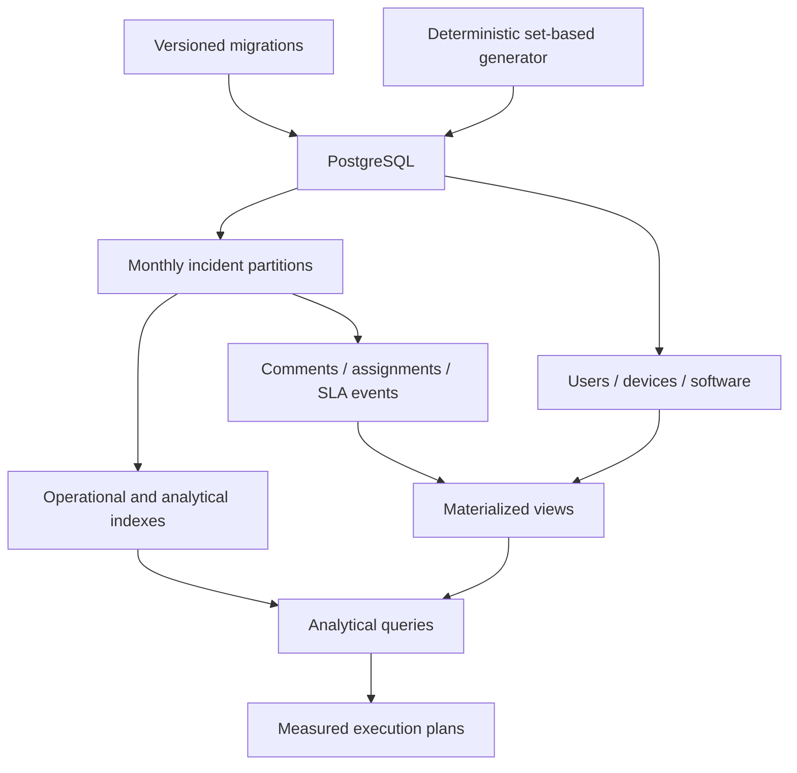

# Architecture and design decisions

## Scope

This repository is a reproducible analytics and database-operations laboratory, not an application. SQL owns the schema, generator, analytical logic, controls, and assertions. Bash only coordinates Docker and `psql`.

## Data flow

The generator is set-based: `generate_series` and deterministic modular arithmetic produce repeatable keys, distributions, timestamps, and relationships. It does not depend on wall-clock time or random-number state.

## Partitioning

`incidents` is range-partitioned monthly by `created_at` from January 2023 through December 2025. PostgreSQL requires a partitioned unique or primary key to include every partition key column, so the identity is `(id, created_at)`. Child tables store both values in their foreign keys.

Monthly partitioning enables pruning for bounded time queries, simplifies time-oriented maintenance, and constrains per-partition indexes. A default partition prevents an unexpected date from rejecting ingestion, while the smoke test requires the deterministic data set to leave it empty.

The trade-off is wider foreign keys and operational responsibility: future partitions must be created before new periods are ingested. A production design would automate ahead-of-time partition creation and alert on rows entering the default partition.

## Index strategy

- The BRIN index on `created_at` is compact and benefits large, naturally time-correlated scans.
- B-tree indexes support selective requester, technician, device, service, status, priority, and software access paths.
- Partial B-tree indexes omit rows irrelevant to active backlog and breach queries.
- A stored `tsvector` plus GIN supports full-text search without recalculating the document for each query.
- Covering columns are used only where a measured access path benefits, to avoid unnecessary write and storage cost.

Analytical indexes are separate from core migrations so the benchmark can remove and recreate them without destroying data. They are examples to validate against a real workload, not universal prescriptions.

## Materialized views

Two materialized views pre-aggregate monthly SLA metrics and technician workload. Each has a unique index, allowing `REFRESH MATERIALIZED VIEW CONCURRENTLY` after its first population. Refresh is explicit because stale-but-consistent analytics can be preferable to adding aggregation cost to every write.

## Consistency and locking

- Migrations acquire a session advisory lock so only one runner advances schema state.
- Retention takes a transaction advisory lock and records every dry-run or execution.
- Device upserts accept an observation only when `last_seen_at` is not older than the stored value.
- Incident audit records are written in the same transaction as the changed incident.
- The deadlock-safe example locks target rows in ascending ID order before updating them.

## Role and RLS boundary

The migration creates no-login group roles and a forced RLS policy on department notes. The transaction-local `app.current_department_id` setting represents a value that a trusted application would establish after authentication. RLS is defense in depth; allowing callers to set that value arbitrarily would defeat the model.

## Scale profiles

`SEED_SCALE` changes high-volume cardinalities while preserving deterministic relationships. Scale `1` is the full specification. The minimum safeguards keep scaled profiles large enough for relational and query tests. CI uses scale `0.002` to validate behavior quickly; it does not claim full-scale performance.
